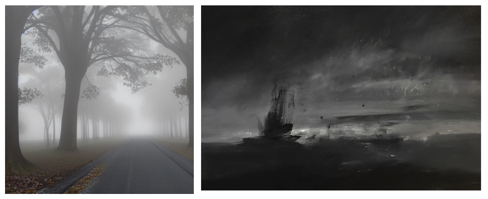

In the fall of 2022, I finally started my journey at University of Edinburgh. *Introduction to One Health* changed my mind. So I wrote my reflective essay.
It will be really interesting to revisit this essay and reflect back at the end of first year on the program and again, later on, when I complete the program…

A Magic Carpet
======
In the fall of 2022, I finally started my journey at University of Edinburgh. *Introduction to One Health* changed my mind. So I wrote my reflective essay.
It will be really interesting to revisit this essay and reflect back at the end of first year on the program and again, later on, when I complete the program…

This reflective essay is based on the **DIEP** model.

Before this course started, I was both apprehensive and looking forward to it. The reason I was interested in learning more about One Health was that I had read some One Health articles sporadically throughout my research but felt confused and wanted others to help me summarize and sort everything out for me. I guess I was looking for more clear expertise and content to solve my usual inspiration drought when writing papers. Rather than relying on my judgment, I wanted someone to help me summarize everything and point me in the right direction.

However, I found that the course didn't give me a clear answer, everything was still obscured by the early morning mist, and the tone was gray because of the lack of light. The challenging books on the reading list, in particular, served as beacons of light when sailing through a stormy night, shining with philosophical reflection, but fading in and out because of the storm. Attending a live session was a useful option to solve this problem, and in the meantime, putting the problem aside for now and continuing to study, and perhaps studying afterward to help understand the sentences in the book.

**Figure 1 Moving forward in fog and storms**

**The image on the left is a view of the grayish tones of the early morning mist that I had in my mind, drawn automatically using artificial intelligence through the Stable Diffusion website. At the beginning, One Health looked like this in my mind: I knew roughly what it meant or what it was about, but I could only see these superficial things, just as I could only see something in front of me in the fog; I knew nothing about the deeper things and felt anxious because of it, just like walking in the fog.**

**The image on the right is by artist Robert Wellings, which I downloaded from the internet. Although I don't know the artist, this work illustrates how I feel when I read the books in the reading list: I feel like I am taking in some new ideas, but it is very challenging, like sailing, wandering but getting closer to the goal.**

When I realized that the course was not that simple and that I could not sit in the nest like a fledgling waiting for someone to send me answers to my questions, it was time to take action. Week after week, the course seemed to have little to do with each other, and the content was general and did not involve specific technical details of the study, but invariably, a lustrous, colorful and gorgeous magic carpet was compiled in my mind.
 
 
 
**Figure 2 The magic carpet**

**I sketched this image to show the magic carpet in my mind. Each colored line or fiber represents the interaction between human, animal and environment, medical, veterinary, sociological, economic and other disciplines. The intersections are the issues or challenges that may arise, such as antibiotic resistance, food safety, zoonotic diseases, etc. These may be the areas that One Health needs to focus on(Gibbs, 2014).**

Through this course, I became more aware of how humans interact with nature and with each other(Rabinowitz et al., 2018). But again, this contradicted the real world. I have been studying antibiotic resistance and the microbiome of pig manure and surrounding environmental soil in several modern pig farms in Shanghai. Recently, the research has come to a deadlock, as during visits to the farms for interview surveys and sampling, the people in charge have been complaining to me about their confusion, as it is clear that the agricultural department encourages them to use pig manure and wastewater for vegetable fertilization on the farms, but the environmental department strictly prohibits this and requires that the waste must be treated through multiple chemical methods to complete clarification and discharge into the sewer. As for the soil on the farm, additional chemical fertilizers will be applied, which will lead to excessive heavy metals, soil caking, and reduced microbial diversity. While listening to their complaints, many images suddenly flashed in my mind, just like the Deep Time Walk in Week 2, I saw the birth of the earth, the evolution of everything, the primitive tribes rounding up wild boars, domesticating them, turning them into domestic animals, then to large farms, then to modern mechanical farms, such as mechanical ventilation, mechanical feeding, mechanical cleaning. It seems that originally, pig manure or human manure should enter the soil to make it fertile, but now more chemicals have to be added to make it so-called clean before it can be discharged into the environment. This can indeed prevent some infectious diseases that are spread through the fecal-oral route, but it seems to have created more and more problems. The assessment of pig farms, which should have been integrated, is now divided among agriculture, animal husbandry, veterinary, environmental, *etc*. It looks more professional and divided, but it also contradicts itself on some things, which is confusing.

We can indeed attribute it to social development, population growth, globalization, and so on. But as I stare at the colorful magic carpet in my heart, it has become patchy. Through the ragged holes, I seem to see a megalomaniac who thinks he has mastered the mystery of life and nature and has started to dictate and interfere with everything to pursue efficiency. Isolating the pigs from the natural environment, shutting them in a small factory, replacing everything with mechanization, adding antibiotics inside the feed to promote growth if the pigs are not growing fast enough, or phenotypic selection to select more productive pigs, and possibly individuals more prone to obesity, perhaps invariably also selecting these microbiomes in the intestines of the pigs more prone to host obesity(Smith, 2020). If there is a potential problem of obesity, then they think of another way to solve it. As one problem after another emerged and was solved by one discipline, a variety of more complex problems continued to emerge, and when no discipline was able to solve such problems, it was as if the megalomania behind the ragged hole suddenly dissipated, leaving behind only a mottled and tattered magic carpet.

Now, I hold this magic carpet, but I don't know what to do. By touching the broken and exposed fibers at the broken hole, I feel like touching those lovely and free little lambs in the meadow. I may not have the means or the ability to fix it now, but I believe I am changing. I no longer just focus on extracting DNA in the lab, analyzing the sequencing results, no longer looking for a single clear and rigid answer, I start to feel the world with my heart. I no longer stand like an adult, I squat down, like a sheep, like grass, feeling the world. Perhaps, this is nothing for others, but for me, it is a big progress and change, I am ecstatic. It is like early morning, with the first ray of sunlight through the mist. And there is a small piece of grass, because of this ray of sunlight, and no longer gray, it becomes tender green, shining with the light of dew. 

**Reference**

Gibbs, E. P. 2014. The evolution of One Health: a decade of progress and challenges for the future. *Vet Rec*, 174, 85-91.

Rabinowitz, P. M., Pappaioanou, M., Bardosh, K. L. & Conti, L. 2018. A planetary vision for one health. *BMJ Global Health*, 3, e001137.

Smith, H. J. 2020. An ethical investigation into the microbiome: the intersection of agriculture, genetics, and the obesity epidemic. *Gut Microbes*, 12, 1760712.

**Appendices**

 
 
 
